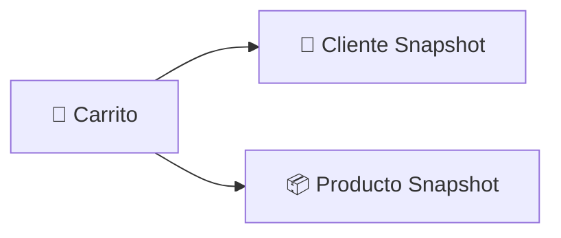
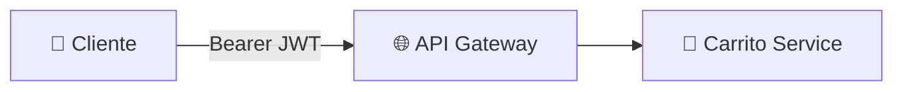
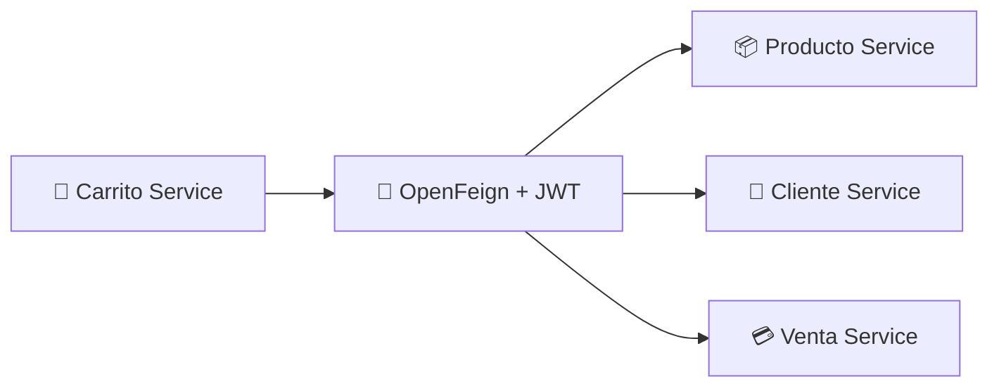
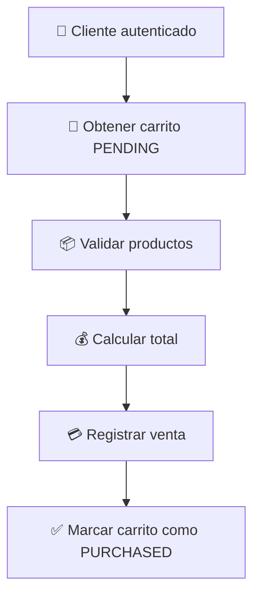

<div align="center">

# 🛒 Carrito Service

### Microservicio de gestión de carritos de compra
#### ElectrodoStore · Orquestador del proceso de compra


</div>

---

Microservicio responsable de la gestión del carrito de compras dentro de **ElectrodoStore**.

Actúa como orquestador del proceso de compra, integrando información proveniente de clientes, productos y ventas mediante comunicación síncrona entre microservicios.

Implementa seguridad basada en **OAuth2 Resource Server**, ownership mediante claims JWT y propagación distribuida de identidad.

---

## 🎯 Responsabilidades

- 🛒 Gestión de carritos de compra
- 📦 Administración de productos dentro del carrito
- 🔢 Validación de cantidades de los productos
- 💰 Cálculo del total de compra
- 🧾 Ejecución del proceso de compra
- 🔐 Gestión basada en ownership
- 📡 Propagación de identidad entre microservicios
- 🔗 Orquestación de cliente-service, producto-service y venta-service

---

## 🧰 Stack tecnológico


---

## 📦 Modelo de dominio



> El carrito almacena **snapshots** de cliente y productos para evitar dependencias externas durante operaciones de lectura, manteniendo consistencia histórica incluso cuando la información original cambia en otros servicios.

---

## 🔐 Modelo de seguridad

El servicio funciona como **OAuth2 Resource Server** y valida localmente los JWT emitidos por Auth Service.

### Claims utilizados

| Claim | Descripción |
| --- | --- |
| `sub` | Username autenticado |
| `userId` | Identificador interno del usuario |
| `clientId` | Identificador del cliente asociado |

### Flujo de autorización



**Proceso:**

1. El usuario envía el JWT al API Gateway
2. Gateway enruta la solicitud a Carrito Service
3. Spring Security valida la firma RSA
4. Se reconstruye la identidad del usuario
5. El claim `clientId` se utiliza para resolver ownership

> 💡 El servicio no requiere comunicación con Auth Service para validar usuarios autenticados.

---

## 👤 Ownership

Las operaciones del carrito utilizan el claim `clientId` obtenido desde el JWT para determinar automáticamente el propietario. No es necesario enviar identificadores de cliente ni de carrito para operaciones personales.

### Endpoints propios

```http
GET    /carritos/me
POST   /carritos/me/productos
DELETE /carritos/me/productos/{productoId}
PATCH  /carritos/me/productos
POST   /carritos/me/comprar
DELETE /carritos/me/productos
```

> El acceso a los recursos se resuelve utilizando la identidad autenticada presente en el `SecurityContext`.

---

## 🔄 Gestión automática de carritos

### Estados del carrito

| Estado | Descripción |
|---------|------------|
| `PENDING` | Carrito activo disponible para agregar, eliminar o modificar productos |
| `PURCHASED` | Carrito cuya compra ya fue completada |

Cuando un cliente agrega productos:

1. Se busca un carrito con estado `PENDING`.
2. Si existe, se reutiliza.
3. Si no existe, se crea automáticamente.
4. Se agregan los productos solicitados.

> De esta manera cada cliente mantiene un único carrito activo durante el proceso de compra.

---

## 🔗 Integración entre microservicios

Carrito Service coordina información proveniente de múltiples dominios:



### Integraciones

| Servicio | Propósito |
| --- | --- |
| `producto-service` | Consulta de productos y validación de stock |
| `cliente-service` | Obtención de información del cliente |
| `venta-service` | Registro de compras |

**Características:**

- 🔗 Comunicación síncrona vía OpenFeign
- 🪙 Propagación automática del JWT
- 🔍 Descubrimiento dinámico con Eureka
- ⚖️ Balanceo con Spring Cloud LoadBalancer

---

## 🛒 Flujo de compra



**Proceso:**

1. Se obtiene el carrito activo del cliente
2. Se validan productos y stock disponible
3. Se calcula el valor total
4. Se registra la venta en `venta-service`
5. El carrito cambia a estado `PURCHASED`

---

## 🛡️ Resiliencia

Las integraciones externas están protegidas mediante:

| Mecanismo | Propósito |
| --- | --- |
| **Retry** | Reintentos automáticos ante fallos transitorios |
| **Circuit Breaker** | Aislamiento de fallos |
| **Fallbacks** | Respuestas controladas ante degradación |

> Esto evita propagación de fallos en cascada dentro del sistema distribuido.

---

## ⚠️ Manejo de errores

Se utiliza manejo centralizado mediante `@RestControllerAdvice`, códigos de error de dominio, traducción de errores provenientes de Feign y respuestas consistentes.

```json
{
  "timestamp": "...",
  "status": 404,
  "error": "NOT_FOUND",
  "errorCode": "PRODUCT_NOT_FOUND",
  "message": "Producto no encontrado"
}
```

---

## 🔍 Traducción de errores remotos

Se implementan `ErrorDecoder` personalizados para interpretar errores provenientes de otros servicios, desacoplando la lógica de negocio de las respuestas HTTP externas.

| Error remoto | Excepción local |
| --- | --- |
| `CLIENT_NOT_FOUND` | `ClienteNotFoundException` |
| `PRODUCT_NOT_FOUND` | `ProductoNotFoundException` |
| `PRODUCT_STOCK_INSUFFICIENT` | `ProductoStockInsuficienteException` |

---

## 🌐 Endpoints

### 👨‍💼 Administración

| Método | Endpoint | Descripción |
| --- | --- | --- |
| `GET` | `/carritos` | Listar todos los carritos |
| `GET` | `/carritos/{id}` | Obtener carrito por ID |

### 👤 Cliente autenticado

| Método | Endpoint | Descripción |
| --- | --- | --- |
| `GET` | `/carritos/me` | Obtener carrito activo |
| `POST` | `/carritos/me/productos` | Agregar productos |
| `DELETE` | `/carritos/me/productos/{productoId}` | Eliminar producto |
| `PATCH` | `/carritos/me/productos` | Modificar cantidad |
| `DELETE` | `/carritos/me/productos` | Vaciar carrito |
| `POST` | `/carritos/me/comprar` | Ejecutar compra |

---

## 🏗️ Arquitectura

- 🌐 API Gateway como punto único de entrada
- 🔐 JWT validado localmente mediante OAuth2 Resource Server
- 👤 Ownership basado en claim `clientId`
- 📡 Propagación de identidad entre microservicios
- 🔗 Integración síncrona mediante OpenFeign
- 🔍 Descubrimiento dinámico con Eureka
- 🛡️ Resiliencia mediante Circuit Breaker y Retry

---

## 💡 Decisiones de diseño

<details>
<summary><b>Snapshots para desacoplamiento de lectura</b></summary>
<br>
Almacenar snapshots evita dependencias externas en tiempo de consulta y garantiza consistencia histórica.
</details>

<details>
<summary><b>Ownership basado en identidad autenticada</b></summary>
<br>
El claim <code>clientId</code> del JWT resuelve automáticamente el propietario sin necesidad de parámetros adicionales.
</details>

<details>
<summary><b>Resolución automática del carrito activo</b></summary>
<br>
Se reutiliza el carrito en estado <code>PENDING</code> o se crea uno nuevo, manteniendo un único carrito activo por cliente.
</details>

<details>
<summary><b>Validación distribuida mediante JWT</b></summary>
<br>
Cada servicio valida el token localmente con la clave pública RSA, sin depender del Auth Service en tiempo de ejecución.
</details>

<details>
<summary><b>Traducción de errores remotos a excepciones de dominio</b></summary>
<br>
Los <code>ErrorDecoder</code> personalizados desacoplan la lógica de negocio de las respuestas HTTP externas.
</details>

<details>
<summary><b>Database per Service</b></summary>
<br>
Cada microservicio gestiona su propia base de datos, reduciendo el acoplamiento entre dominios.
</details>
